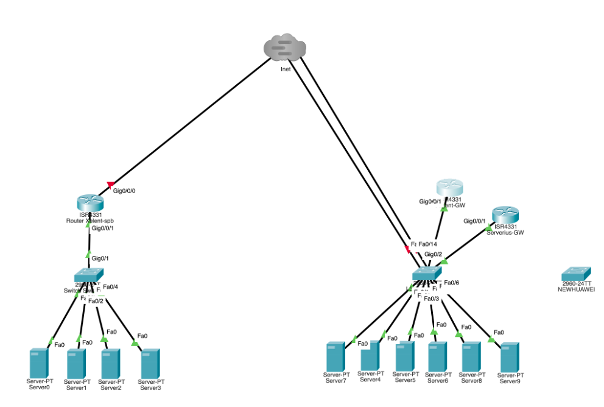
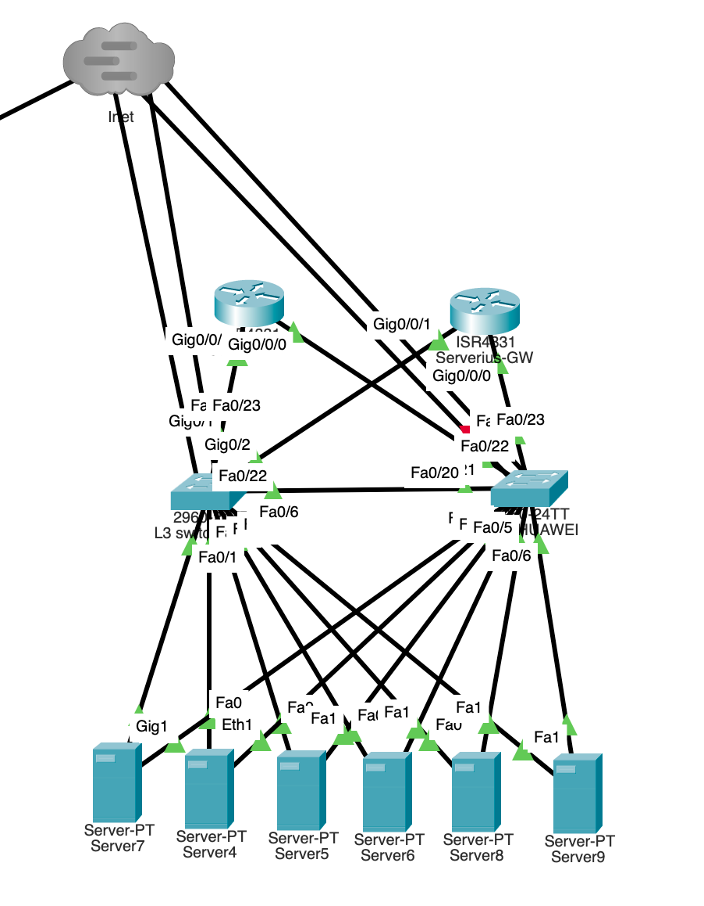

### Цели работы ###
1. Модернизация технологической сети voip провайдера.
2. Обеспечение отказоустойчивости сети.
3. Обеспечение безопасности сети.
4. Бэкап сетевых настроек и логов сетевых устройств.

### Что планировалось ###
1. Добавление второго коммутатора L3 в сеть.
2. Обеспечение отказоустойчивости сети.
3. Внедрение технологий управления трафиком.
4. Доступность серверов из WAN.
5. Настройка GRE тоннелей

### Используемые технологии ###
1. VLAN
2. VRRP (Virtual Router Redundancy Protocol)
3. STP
4. DHCP
5. QoS
6. NTP
7. NAT
8. SYSLOG
9. GRE/IPSec

### Анализ и схема существующей сети ###


Изначально сеть состоит из 2-х роутеров Mikrotik CCR1009-1G-C-15plus
- 1-ый маршрутизатор(Cogent-GW) не является шлюзом, но на нем базируется вся сеть стойки. То есть тут выдается DHCP, VLAN, WireGuard, туннели и так далее.
- 2-ой (Serverius-GW) для gre тунелей и на нем используюься ip адреса Serverius
- коммутатор Huawei S5720S-52X-SI-AC, к который выполняет роль ядра сети. К коммутатору приходит интернет от двух провайдеров Cogent и Serverius и сюда подключены все серверы.

### Анализ использованных технологий: #
На роутерах настроены ACL для разграничения прав доступа к сетям.
Почти все Ip адреса задаются в ручную(static) 
Для связи между дата центрами используется GRE-тунель 

### Провести оценку производительности сети: #
В целом производительности сети на данный момент хватает

### Идентификация узких мест и проблемных зон: #
Так как сеть используется для передачи медиа трафика(UDP), то периодически возникают проблемы с потерей пакетов, что критично для конечных абонентов


** Предлагается добавлениюе второго коммутатора и обеспечению полного резервирования каналов и оборудования: **


### 1. Добавление второго коммутатора Huawei S5720S-52X-SI-AC:
- Установливаем второй коммутатор для повышения отказоустойчивости сети и увеличения пропускной способности.
- Настроиваем второй коммутатор таким образом, чтобы он мог настроиться на работу как резервный для первого коммутатора в случае возникновения проблем или отказа основного устройства.

### 2. Резервирование каналов:
- Подключаем каждый коммутатор к обоим провайдерам интернета (Cogent и Serverius) для обеспечения непрерывного доступа к сети в случае отказа одного из провайдеров.
- Настроиваем маршрутизацию с использованием протоколов OSPF или BGP для автоматического переключения трафика между провайдерами в случае обрыва канала.

### 3. Обеспечение резервирования оборудования:
- Создаем дублирующие конфигурации на обоих роутерах Mikrotik для быстрого восстановления настроек в случае сбоя в основном устройстве.
- Установливаем процедуры и инструменты для мониторинга работоспособности оборудования и автоматического переключения на резервное оборудование при обнаружении проблем.


# 1. Добавление второго коммутатора Huawei



Для добавления второго коммутатора Huawei S5720S-52X-SI-AC в сеть и настройки его как резервного устройства для повышения отказоустойчивости и увеличения пропускной способности, можно выполнить следующие шаги:

### Общая таблица сетей. ###

|Network IPv4     	|Description
|-------------------|------------------------|
|10.8.230.0/24	    |Serverius local network |	
|10.8.240.0/24  	  |Gogent local network	   |
|66.249.44.224/27 	|Serverius network	     |
|55.255.64.208/28	  |Gogent network	         |
|77.155.208.230/28	|Xelent network	         |

Пример расчета подсетей 10.8.230.0 и 10.8.240.0 с числом хостов = 254

Для создания двух подсетей на основе адресов 10.8.230.0 и 10.8.240.0 с необходимым количеством хостов(254), мы можем использовать следующие подсети:

1. Подсеть 10.8.230.0:
   - Адрес подсети: 10.8.230.0
   - Маска подсети: 255.255.255.0 (/24)
   - Эта подсеть поддерживает 2^8 - 2 = 254 хостов.

2. Подсеть 10.8.240.0:
   - Адрес подсети: 10.8.240.0
   - Маска подсети: для поддержки максимального количества хостов, мы можем использовать маску подсети 255.255.255.0 (/24) или даже 255.255.252.0 (/22), чтобы увеличить количество доступных хостов.
   - При использовании маски подсети 255.255.252.0 (/22), данная подсеть сможет поддерживать 2^10 - 2 = 1022 хоста.
### 1.1 Физическое подключение:
- Установливаем второй коммутатор Huawei S5720S-52X-SI-AC в сеть, подключив его к уже существующей сети с использованием высокоскоростных соединений (Ethernet или оптические кабели).
- Подключаем второй коммутатор к тому же оборудованию, к которому подключен первый коммутатор (сервера, маршрутизаторы, провайдеры интернета и т. д.).

### 1.2 Конфигурация второго коммутатора:
- Настроиваем IP-адрес и базовые настройки второго коммутатора для его подключения к сети.
- Настраиваем VLAN, trunk-порты и другие необходимые параметры коммутатора в соответствии с текущей конфигурацией сети.

1.2.1 *Настройка IP-адреса и базовых параметров:*
```
Switch> enable
Switch# configure terminal
Switch(config)# hostname SW2
SW2(config)# interface vlan 1
SW2(config-if)# ip address 192.168.1.2 255.255.255.0
SW2(config-if)# no shutdown
SW2(config-if)# exit
SW2(config)# exit
```

1.2.2 *Настройка VLAN и trunk-портов:**
```
SW2(config)# vlan 10
SW2(config-vlan)# name Sales
SW2(config)# vlan 20
SW2(config-vlan)# name Marketing
SW2(config)# interface gigabitethernet 0/1
SW2(config-if)# switchport mode trunk
SW2(config-if)# switchport trunk allowed vlan 10,20
SW2(config)# interface gigabitethernet 0/2
SW2(config-if)# switchport mode access
SW2(config-if)# switchport access vlan 10
```

1.2.3 *Сохранение конфигурации:*
```
SW2# copy running-config startup-config
```

### 1.3 Настройка VRRP (Virtual Router Redundancy Protocol):
- Настраеваем VRRP на обоих коммутаторах для обеспечения отказоустойчивости между ними.
- Настраиваем второй коммутатор в качестве резервного (backup) устройства, которое автоматически принимает на себя работу основного коммутатора в случае его отказа.

Для настройки VRRP (Virtual Router Redundancy Protocol) на обоих коммутаторах можно использовать следующие команды:

1.3.1 *Настройка основного коммутатора (Primary):*
```
Switch> enable
Switch# configure terminal
Switch(config)# interface vlan 1
Switch(config-if)# vrrp 1 ip 192.168.1.1
Switch(config-if)# vrrp 1 priority 110
Switch(config-if)# vrrp 1 preempt
Switch(config-if)# exit
Switch(config)# exit
```

1.3.2. *Настройка резервного коммутатора (Backup):*
```
Switch> enable
Switch# configure terminal
Switch(config)# interface vlan 1
Switch(config-if)# vrrp 1 ip 192.168.1.1
Switch(config-if)# vrrp 1 priority 100
Switch(config-if)# exit
Switch(config)# exit
```
В этом примере настроен VRRP с группой номер 1 на коммутаторах. Основной коммутатор имеет более высокий приоритет (110), что позволяет ему быть основным устройством, а резервный коммутатор имеет приоритет 100. Параметр "preempt" на основном коммутаторе позволяет ему вернуться в роль основного устройства после восстановления.


# 2. Резервирование каналов:

Для резервирования каналов и обеспечения непрерывного доступа к сети при использовании двух провайдеров интернета (Cogent и Serverius), можно выполнить следующие шаги:

### 2.1 Физическое подключение:
- Подключаем каждый коммутатор к обоим провайдерам интернета (Cogent и Serverius) с использованием отдельных выделенных линий или портов для каждого провайдера.
- Убеждаемся в правильном подключении и наличии резервных маршрутов для обоих провайдеров.

### 2.2 Настройка маршрутизации:
- Настраиваем протокол маршрутизации OSPF или BGP на коммутаторах для обмена информацией о сети с провайдерами и другими устройствами в сети.
- Создаем два независимых маршрута для каждого провайдера, чтобы обеспечить возможность автоматического переключения трафика в случае отказа одного из провайдеров.

Для настройки маршрутизации с использованием протокола OSPF или BGP на коммутаторах Cisco и создания двух независимых маршрутов для каждого провайдера, чтобы обеспечить отказоустойчивость, можно использовать следующие примеры команд:

2.2.1 *Настройка OSPF:*
```
Switch> enable
Switch# configure terminal
Switch(config)# router ospf 1
Switch(config-router)# network 192.168.1.0 0.0.0.255 area 0
Switch(config-router)# network 192.168.2.0 0.0.0.255 area 0
Switch(config-router)# network 10.10.10.0 0.0.0.255 area 0
Switch(config-router)# exit
Switch(config)# exit
```

2.2.2. *Настройка BGP:*
```
Switch> enable
Switch# configure terminal
Switch(config)# router bgp 65000
Switch(config-router)# neighbor 192.168.1.2 remote-as 65001
Switch(config-router)# neighbor 192.168.1.2 update-source Loopback0
Switch(config-router)# neighbor 192.168.1.3 remote-as 65002
Switch(config-router)# neighbor 192.168.1.3 update-source Loopback0
Switch(config-router)# exit
Switch(config)# ip route 0.0.0.0 0.0.0.0 192.168.1.2
Switch(config)# ip route 0.0.0.0 0.0.0.0 192.168.1.3
Switch(config)# exit
```

В этих примерах настроены протоколы маршрутизации OSPF и BGP. Для OSPF была настроена область сети и указаны подсети для обмена маршрутной информацией. Для BGP были добавлены соседи с указанием remote-as и update-source для Loopback интерфейса. Также были созданы два независимых маршрута (для каждого провайдера) с использованием команд ip route.


3. Настройка маршрутных политик:
- Настраиваем маршрутные политики для определения приоритетов маршрутов и условий переключения трафика между провайдерами.
- Установливаем механизмы контроля качества обслуживания (QoS) для предоставления приоритета трафику в зависимости от его важности.

Для настройки маршрутных политик и механизмов контроля качества обслуживания (QoS) на коммутаторах Cisco, используйте следующие примеры команд:

3.1. Настройка маршрутных политик:
```
Switch> enable
Switch# configure terminal
Switch(config)# ip route 0.0.0.0 0.0.0.0 192.168.1.2 100
Switch(config)# ip route 0.0.0.0 0.0.0.0 192.168.1.3 200
Switch(config)# exit
```

3.2. Настройка механизмов QoS:
```
Switch> enable
Switch# configure terminal
Switch(config)# access-list 101 permit tcp any any eq 80
Switch(config)# class-map HTTP
Switch(config-cmap)# match access-group 101
Switch(config-cmap)# exit
Switch(config)# policy-map QoS
Switch(config-pmap)# class HTTP
Switch(config-pmap-c)# set dscp af21
Switch(config-pmap-c)# exit
Switch(config-pmap)# exit
Switch(config)# interface GigabitEthernet0/1
Switch(config-if)# service-policy input QoS
Switch(config-if)# exit
Switch(config)# exit
```

В этих примерах настроены маршрутные политики для установления приоритетов маршрутов с помощью команд ip route и установлены механизмы QoS с использованием классификации трафика (access-list и class-map), определения политики QoS (policy-map) и применения политики на интерфейсе (service-policy).


# 3. Обеспечение резервирования оборудования:

Для обеспечения резервирования оборудования и быстрого восстановления работы в случае сбоя основного устройства, можно выполнить следующие шаги:

### 1. Создание дублирующих конфигураций:
- Конфигурируем оба роутера Mikrotik с идентичными настройками и параметрами сети.
- Регулярно обновлять и синхронизировать конфигурации обоих роутеров для поддержания актуальности и соответствия.

### 2. Установка процедур и инструментов мониторинга:
- Внедрим систему мониторинга работоспособности оборудования, такую как Zabbix, Nagios или другие.
- Настроим мониторинг ключевых параметров обоих роутеров, таких как загрузка ЦП, использование памяти, статус интерфейсов и т.д.
- Создадим правила и сценарии для автоматического оповещения администраторов и смены конфигурации на резервное оборудование в случае обнаружения проблем или сбоя основного устройства.


### 3. Организация резервного оборудования:
- Необходимо подготовить резервное оборудование, настроив его заранее с идентичными настройками основного устройства.
- Необходимо установить механизмы автоматического переключения на резервное оборудование при обнаружении проблем, например, с помощью протоколов VRRP (Virtual Router Redundancy Protocol) или HSRP (Hot Standby Router Protocol).

