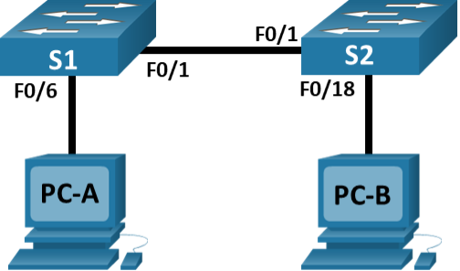

**Лабораторная работа. Просмотр таблицы MAC-адресов коммутатора**

# **Топология**

# **Таблица адресации**

|**Устройство**|**Интерфейс**|**IP-адрес**|**Маска подсети**|
| :-: | :-: | :-: | :-: |
|S1|VLAN 1|192\.168.1.11|255\.255.255.0|
|S2|VLAN 1|192\.168.1.12|255\.255.255.0|
|PC-A|NIC|192\.168.1.1|255\.255.255.0|
|PC-B|NIC|192\.168.1.2|255\.255.255.0|
# **Цели**
**Часть 1. Создание и настройка сети**
**Часть 2. Изучение таблицы МАС-адресов коммутатора**

1. ## **Создание и настройка сети**
   1. ### **Подключите сеть в соответствии с топологией.**
   1. ### **Настройте узлы ПК.**
   1. ### **Выполните инициализацию и перезагрузку коммутаторов.**
   1. ### **Настройте базовые параметры каждого коммутатора.**
      *Откройте окно конфигурации*

      1. Настройте имена устройств в соответствии с топологией.
      1. Настройте IP-адреса, как указано в таблице адресации.
      1. Назначьте **cisco** в качестве паролей консоли и VTY.
      1. Назначьте **class** в качестве пароля доступа к привилегированному режиму EXEC.

*Закройте окно настройки.*
1. ## **Изучение таблицы МАС-адресов коммутатора**
Как только между сетевыми устройствами начинается передача данных, коммутатор выясняет МАС-адреса и строит таблицу.
1. ### **Запишите МАС-адреса сетевых устройств.**
   1. Откройте командную строку на PC-A и PC-B и введите команду **ipconfig /all**.

*Открытие окна командной строки Windows*
#### Вопрос:
Назовите физические адреса адаптера Ethernet.

MAC-адрес компьютера PC-A: 0002.17AC.D288

MAC-адрес компьютера PC-B: 0060.47C4.0BA6

*Закройте окно командной строки.*

1. Подключитесь к коммутаторам S1 и S2 через консоль и введите команду **show interface F0/1** на каждом коммутаторе.

*Откройте окно конфигурации*
#### Вопросы:
Назовите адреса оборудования во второй строке выходных данных команды (или зашитый адрес — bia).

МАС-адрес коммутатора S1 Fast Ethernet 0/1: bia 0001.9768.a201

МАС-адрес коммутатора S2 Fast Ethernet 0/1: bia 0009.7c3d.d601

*Закройте окно настройки.*
1. ### **Просмотрите таблицу МАС-адресов коммутатора.**
Подключитесь к коммутатору S2 через консоль и просмотрите таблицу МАС-адресов до и после тестирования сетевой связи с помощью эхо-запросов.

1. Подключитесь к коммутатору S2 через консоль и войдите в привилегированный режим EXEC.

*Откройте окно конфигурации*

1. В привилегированном режиме EXEC введите команду **show mac address-table** и нажмите клавишу ввода.

   S2# **show mac address-table**

   `          `Mac Address Table

   -------------------------------------------

   Vlan    Mac Address       Type        Ports

   ----    -----------       --------    -----

   `   `1    0001.9768.a201    DYNAMIC     Fa0/1

   Даже если сетевая коммуникация в сети не происходила (т. е. если команда ping не отправлялась), коммутатор может узнать МАС-адреса при подключении к ПК и другим коммутаторам.
   #### Вопросы:
   Записаны ли в таблице МАС-адресов какие-либо МАС-адреса?

   Какие МАС-адреса записаны в таблице? С какими портами коммутатора они сопоставлены и каким устройствам принадлежат? Игнорируйте МАС-адреса, сопоставленные с центральным процессором.

   Если вы не записали МАС-адреса сетевых устройств в шаге 1, как можно определить, каким устройствам принадлежат МАС-адреса, используя только выходные данные команды **show mac address-table**? Работает ли это решение в любой ситуации?
1. ### **Очистите таблицу МАС-адресов коммутатора S2 и снова отобразите таблицу МАС-адресов.**
   1. В привилегированном режиме EXEC введите команду **clear mac address-table dynamic** и нажмите клавишу **Enter**.

      S2# **clear mac address-table dynamic**

   1. Снова быстро введите команду **show mac address-table**.

      Mac Address Table

      -------------------------------------------

      Vlan Mac Address Type Ports

      ---- ----------- -------- -----

   1. Вопросы:

      Указаны ли в таблице МАС-адресов адреса для VLAN 1? Указаны ли другие МАС-адреса?

      Через 10 секунд введите команду **show mac address-table** и нажмите клавишу ввода. Появились ли в таблице МАС-адресов новые адреса?

*е* 
1. ### **С компьютера PC-B отправьте эхо-запросы устройствам в сети и просмотрите таблицу МАС-адресов коммутатора.**
   1. На компьютере PC-B откройте командную строку и еще раз введите команду **arp -a**.

      C:\>arp -a

      No ARP Entries Found

*Откройте командную строку.*
#### Вопрос:
Не считая адресов многоадресной и широковещательной рассылки, сколько пар IP- и МАС-адресов устройств было получено через протокол ARP?

1. Из командной строки PC-B отправьте эхо-запросы на компьютер PC-A, а также коммутаторы S1 и S2.
   #### Вопрос:
   От всех ли устройств получены ответы? Если нет, проверьте кабели и IP-конфигурации.

*Закройте командную строку.*

1. Подключившись через консоль к коммутатору S2, введите команду **show mac address-table**.

*Откройте окно* 

`	`Mac Address Table

\-------------------------------------------

Vlan Mac Address Type Ports

\---- ----------- -------- -----

1 0001.9768.a201 DYNAMIC Fa0/1

1 0002.17ac.d288 DYNAMIC Fa0/1

1 000d.bdc1.58aa DYNAMIC Fa0/1

1 0060.47c4.0ba6 DYNAMIC Fa0/18
#### Вопрос:
Добавил ли коммутатор в таблицу МАС-адресов дополнительные МАС-адреса? Если да, то какие адреса и устройства?

На компьютере PC-B откройте командную строку и еще раз введите команду **arp -a**.
#### Вопрос:
C:\>arp -a

Internet Address Physical Address Type

192\.168.1.1 0002.17ac.d288 dynamic

192\.168.1.11 000d.bdc1.58aa dynamic

192\.168.1.12 0050.0f2c.e2d3 dynamic

Появились ли в ARP-кэше компьютера PC-B дополнительные записи для всех сетевых устройств, которым были отправлены эхо-запросы?

*Закройте командную строку.*
# **Вопрос для повторения**
В сетях Ethernet данные передаются на устройства по соответствующим МАС-адресам. Для этого коммутаторы и компьютеры динамически создают ARP-кэш и таблицы МАС-адресов. Если компьютеров в сети немного, эта процедура выглядит достаточно простой. Какие сложности могут возникнуть в крупных сетях?
© ã 2013 г. - гггг Корпорация Cisco и/или ее дочерние компании. Все права защищены. Открытая информация Cisco 	страница 11** 11**	www.netacad.com
