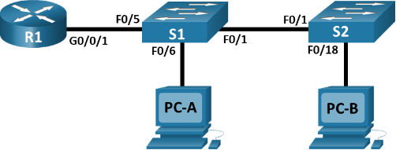
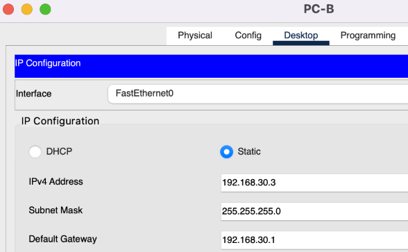
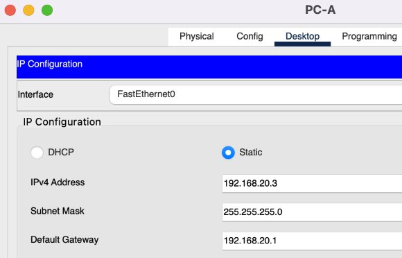

**Лабораторная работа - Внедрение маршрутизации между виртуальными локальными сетями** 
# **Топология**

# **Таблица адресации**

|**Устройство**|**Интерфейс**|**IP-адрес**|**Маска подсети**|**Шлюз по умолчанию**|
| :-: | :-: | :-: | :-: | :-: |
|R1|G0/0/1.10|192\.168.10.1|255\.255.255.0|—|
|*R1*|G0/0/1.20|192\.168.20.1|255\.255.255.0|*—*|
|*R1*|G0/0/1.30|192\.168.30.1|255\.255.255.0|*—*|
|*R1*|G0/0/1.1000|—|—|*—*|
|S1|VLAN 10|192\.168.10.11|255\.255.255.0|192\.168.10.1|
|S2|VLAN 10|192\.168.10.12|255\.255.255.0|192\.168.10.1|
|PC-A|NIC|192\.168.20.3|255\.255.255.0|192\.168.20.1|
|PC-B|NIC|192\.168.30.3|255\.255.255.0|192\.168.30.1|
# **Таблица VLAN**

|**VLAN**|**Имя**|**Назначенный интерфейс**|
| :-: | :-: | :-: |
|10|Управление|<p>S1: VLAN 10 </p><p>S2: VLAN 10 </p>|
|20|Sales|S1: F0/6|
|30|Operations|S2: F0/18|
|999|Parking\_Lot|<p>С1: F0/2-4, F0/7-24, G0/1-2</p><p>С2: F0/2-17, F0/19-24, G0/1-2</p>|
|1000|Собственная|—|
# **Задачи**
**Часть 1. Создание сети и настройка основных параметров устройства**

**Часть 2. Создание сетей VLAN и назначение портов коммутатора**

**Часть 3. Настройка транка 802.1Q между коммутаторами.**

**Часть 4. Настройка маршрутизации между сетями VLAN**

**Часть 5. Проверка, что маршрутизация между VLAN работает**
# **Необходимые ресурсы**
- 1 Маршрутизатор (Cisco 4221 с универсальным образом Cisco IOS XE версии 16.9.4 или аналогичным)
- 2 коммутатора (Cisco 2960 с операционной системой Cisco IOS 15.2(2) (образ lanbasek9) или аналогичная модель)
- 2 ПК (ОС Windows с программой эмуляции терминалов, такой как Tera Term)
- Консольные кабели для настройки устройств Cisco IOS через консольные порты.
- Кабели Ethernet, расположенные в соответствии с топологией
  # **Инструкции**
  1. ## **Создание сети и настройка основных параметров устройства**
В первой части лабораторной работы вам предстоит создать топологию сети и настроить базовые параметры для узлов ПК и коммутаторов.
1. ### **Создайте сеть согласно топологии.**
Подключите устройства, как показано в топологии, и подсоедините необходимые кабели.
1. ### **Настройте базовые параметры для маршрутизатора.**
   1. Подключитесь к маршрутизатору с помощью консоли и активируйте привилегированный режим EXEC.


1. Войдите в режим конфигурации.
1. Назначьте маршрутизатору имя устройства.
1. Отключите поиск DNS, чтобы предотвратить попытки маршрутизатора неверно преобразовывать введенные команды таким образом, как будто они являются именами узлов.
1. Назначьте **class** в качестве зашифрованного пароля привилегированного режима EXEC.
1. Назначьте **cisco** в качестве пароля консоли и включите вход в систему по паролю.
1. Установите **cisco** в качестве пароля виртуального терминала и активируйте вход.
1. Зашифруйте открытые пароли.
1. Создайте баннер с предупреждением о запрете несанкционированного доступа к устройству.
1. Сохраните текущую конфигурацию в файл загрузочной конфигурации.
1. Настройте на маршрутизаторе время.
```
Router>en

Router#conf t

Enter configuration commands, one per line. End with CNTL/Z.

Router(config)#hostname R1 

R1(config)#ip domain-lookup 

R1(config)#enable secret class 

R1(config)#line console 0 

R1(config-line)#password cisco 

R1(config-line)#login

R1(config-line)#exit

R1(config)#line vty 0 15 

R1(config-line)#password cisco 

R1(config-line)#login

R1(config-line)#exi

R1(config-line)#exit 

R1(config)#service password-encryption

R1(config)#banner motd ^Authorized Access Only^

R1(config)#exit

R1#clock set 23:30:00 27 june 2024 

R1#copy running-config startup-config
```
1. ### **Настройте базовые параметры каждого коммутатора.**
   1. Присвойте коммутатору имя устройства.
   1. Отключите поиск DNS, чтобы предотвратить попытки маршрутизатора неверно преобразовывать введенные команды таким образом, как будто они являются именами узлов.
   1. Назначьте **class** в качестве зашифрованного пароля привилегированного режима EXEC.
   1. Назначьте **cisco** в качестве пароля консоли и включите вход в систему по паролю.
   1. Установите **cisco** в качестве пароля виртуального терминала и активируйте вход.
   1. Зашифруйте открытые пароли.
   1. Создайте баннер с предупреждением о запрете несанкционированного доступа к устройству.
   1. Настройте на коммутаторах время.
   1. Сохранение текущей конфигурации в качестве начальной.
```
Switch>enable

Switch# 

Switch#conf t

Enter configuration commands, one per line. End with CNTL/Z.

Switch(config)#hostname S1

S1(config)#no ip domain-lookup 

S1(config)#enable secret class 

S1(config)#line console 0

S1(config-line)#password cisco 

S1(config-line)#login

S1(config-line)#exit

S1(config)#line vty 0 15 

S1(config-line)#password cisco 

S1(config-line)#

S1(config-line)#login

S1(config-line)#exit

S1(config)#service password-encryption

S1(config)#banner motd ^Autorized Access Only^ 

S1(config)#exit

S1#

S1#clock set 23:34:00 27 june 2024 

S1#copy running-config startup-config 

Switch>

Switch>enable

Switch#conf t

Enter configuration commands, one per line. End with CNTL/Z.

Switch(config)#hostname S2

S2(config)#no ip domain-lookup 

S2(config)#enable secret class 

S2(config)#line console 0

S2(config-line)#password cisco 

S2(config-line)#login

S2(config-line)#exit

S2(config)#line vty 0 15 

S2(config-line)#password cisco 

S2(config-line)#login

S2(config-line)#exit

S2(config)#service password-encryption

S2(config)#banner motd ^Autorized Access Only^ 

S2(config)#exi

S2(config)#exit 

S2#clock set 23:36:00 27 june 2024 

S2#copy running-config startup-config
```
1. ### **Настройте узлы ПК.**


1. ## **Создание сетей VLAN и назначение портов коммутатора**
Во второй части вы создадите VLAN, как указано в таблице выше, на обоих коммутаторах. Затем вы назначите VLAN соответствующему интерфейсу и проверите настройки конфигурации. Выполните следующие задачи на каждом коммутаторе.
1. ### **Создайте сети VLAN на коммутаторах.**
   1. Создайте и назовите необходимые VLAN на каждом коммутаторе из таблицы выше.
```
S1>en

Password: 

S1#conf t

Enter configuration commands, one per line. End with CNTL/Z.

S1(config)#vlan 10 

S1(config-vlan)#name Managment 

S1(config-vlan)#end

S1#conf t

Enter configuration commands, one per line. End with CNTL/Z.

S1(config)#vlan 20 

S1(config-vlan)#name Sales 

S1(config-vlan)#end


S1#conf t

Enter configuration commands, one per line. End with CNTL/Z.

S1(config)#vlan 30 

S1(config-vlan)#name Operations 

S1(config-vlan)#end

S1(config)#vlan 999

S1(config-vlan)#name Parking\_Lot 

S1(config-vlan)#end

S2#conf t

Enter configuration commands, one per line. End with CNTL/Z.

S2(config)#vlan 10 

S2(config-vlan)#name Managment 

S2(config-vlan)#

S2#

%SYS-5-CONFIG\_I: Configured from console by console

S2#conf t

Enter configuration commands, one per line. End with CNTL/Z.

S2(config)#vlan 20 

S2(config-vlan)#name Sales 

S2(config-vlan)#

S2#

%SYS-5-CONFIG\_I: Configured from console by console

S2#conf t

Enter configuration commands, one per line. End with CNTL/Z.

S2(config)#vlan 30

S2(config-vlan)#name Operations

S2(config-vlan)#

S2#

%SYS-5-CONFIG\_I: Configured from console by console

S2#conf t

Enter configuration commands, one per line. End with CNTL/Z.

S2(config)#vlan 999

S2(config-vlan)#name Parking\_Lot

S2(config-vlan)#
```
1. Настройте интерфейс управления и шлюз по умолчанию на каждом коммутаторе, используя информацию об IP-адресе в таблице адресации. 
```
S1>en

Password: 

S1#conf t

Enter configuration commands, one per line. End with CNTL/Z.

S1(config)#int vlan10

S1(config-if)# 

%LINK-5-CHANGED: Interface Vlan10, changed state to up

S1(config-if)#ip address 192.168.10.11 255.255.255.0 

S1(config-if)#no shutdown 

S1(config-if)#ip default-gateway 192.168.10.1

S2#conf t

S2(config)#interface vlan10

S2(config-if)#

%LINK-5-CHANGED: Interface Vlan10, changed state to up

S2(config-if)#ip address 192.168.10.12 255.255.255.0

S2(config-if)#no shutdown

S2(config)#ip default-gateway 192.168.10.1

S2(config)#end
```


1. Назначьте все неиспользуемые порты коммутатора VLAN Parking\_Lot, настройте их для статического режима доступа и административно деактивируйте их.
```
S1#conf t

Enter configuration commands, one per line. End with CNTL/Z.

S1(config)#interface range f0/2-4,f0/7-24,g0/1-2 

S1(config-if-range)#switchport mode access 

S1(config-if-range)#switchport access vlan 999

S1(config-if-range)#shutdown 

%LINK-5-CHANGED: Interface FastEthernet0/2, changed state to administratively down

%LINK-5-CHANGED: Interface FastEthernet0/3, changed state to administratively down

%LINK-5-CHANGED: Interface FastEthernet0/4, changed state to administratively down

%LINK-5-CHANGED: Interface FastEthernet0/7, changed state to administratively down

%LINK-5-CHANGED: Interface FastEthernet0/8, changed state to administratively down

%LINK-5-CHANGED: Interface FastEthernet0/9, changed state to administratively down

%LINK-5-CHANGED: Interface FastEthernet0/10, changed state to administratively down

%LINK-5-CHANGED: Interface FastEthernet0/11, changed state to administratively down

%LINK-5-CHANGED: Interface FastEthernet0/12, changed state to administratively down

%LINK-5-CHANGED: Interface FastEthernet0/13, changed state to administratively down

%LINK-5-CHANGED: Interface FastEthernet0/14, changed state to administratively down

%LINK-5-CHANGED: Interface FastEthernet0/15, changed state to administratively down

%LINK-5-CHANGED: Interface FastEthernet0/16, changed state to administratively down

%LINK-5-CHANGED: Interface FastEthernet0/17, changed state to administratively down

%LINK-5-CHANGED: Interface FastEthernet0/18, changed state to administratively down

%LINK-5-CHANGED: Interface FastEthernet0/19, changed state to administratively down

%LINK-5-CHANGED: Interface FastEthernet0/20, changed state to administratively down

%LINK-5-CHANGED: Interface FastEthernet0/21, changed state to administratively down

%LINK-5-CHANGED: Interface FastEthernet0/22, changed state to administratively down

%LINK-5-CHANGED: Interface FastEthernet0/23, changed state to administratively down

%LINK-5-CHANGED: Interface FastEthernet0/24, changed state to administratively down

%LINK-5-CHANGED: Interface GigabitEthernet0/1, changed state to administratively down

%LINK-5-CHANGED: Interface GigabitEthernet0/2, changed state to administratively down

S1(config-if-range)#

S2>en

Password: 

S2#conf t

Enter configuration commands, one per line. End with CNTL/Z.

S2(config)#interface range f0/2-17,f0/19-24,g0/1-2 

S2(config-if-range)#switchport mode access 

S2(config-if-range)#switchport access vlan 999 

S2(config-if-range)#shutdown

%LINK-5-CHANGED: Interface FastEthernet0/2, changed state to administratively down

%LINK-5-CHANGED: Interface FastEthernet0/3, changed state to administratively down

%LINK-5-CHANGED: Interface FastEthernet0/4, changed state to administratively down

%LINK-5-CHANGED: Interface FastEthernet0/5, changed state to administratively down

%LINK-5-CHANGED: Interface FastEthernet0/6, changed state to administratively down

%LINK-5-CHANGED: Interface FastEthernet0/7, changed state to administratively down

%LINK-5-CHANGED: Interface FastEthernet0/8, changed state to administratively down

%LINK-5-CHANGED: Interface FastEthernet0/9, changed state to administratively down

%LINK-5-CHANGED: Interface FastEthernet0/10, changed state to administratively down

%LINK-5-CHANGED: Interface FastEthernet0/11, changed state to administratively down

%LINK-5-CHANGED: Interface FastEthernet0/12, changed state to administratively down

%LINK-5-CHANGED: Interface FastEthernet0/13, changed state to administratively down

%LINK-5-CHANGED: Interface FastEthernet0/14, changed state to administratively down

%LINK-5-CHANGED: Interface FastEthernet0/15, changed state to administratively down

%LINK-5-CHANGED: Interface FastEthernet0/16, changed state to administratively down

%LINK-5-CHANGED: Interface FastEthernet0/17, changed state to administratively down

%LINK-5-CHANGED: Interface FastEthernet0/19, changed state to administratively down

%LINK-5-CHANGED: Interface FastEthernet0/20, changed state to administratively down

%LINK-5-CHANGED: Interface FastEthernet0/21, changed state to administratively down

%LINK-5-CHANGED: Interface FastEthernet0/22, changed state to administratively down

%LINK-5-CHANGED: Interface FastEthernet0/23, changed state to administratively down

%LINK-5-CHANGED: Interface FastEthernet0/24, changed state to administratively down

%LINK-5-CHANGED: Interface GigabitEthernet0/1, changed state to administratively down

%LINK-5-CHANGED: Interface GigabitEthernet0/2, changed state to administratively down

S2(config-if-range)#
```
1. ### **Назначьте сети VLAN соответствующим интерфейсам коммутатора.**
   1. Назначьте используемые порты соответствующей VLAN (указанной в таблице VLAN выше) и настройте их для режима статического доступа.
```
S1(config)#int f0/6 

S1(config-if)#switchport mode access 

S1(config-if)#switchport access vlan 20 

S1(config-if)#end

S1(config)#int f0/6 

S1(config-if)#switchport mode access 

S1(config-if)#switchport access vlan 20 

S1(config-if)#end
```
1. Убедитесь, что VLAN назначены на правильные интерфейсы.
```
S1#show vlan

VLAN Name Status Ports

\---- -------------------------------- --------- -------------------------------

1 default active Fa0/1, Fa0/5

10 Managment active 

20 Sales active Fa0/6

30 Operations active 

999 Parking\_Lot active Fa0/2, Fa0/3, Fa0/4, Fa0/7

Fa0/8, Fa0/9, Fa0/10, Fa0/11

Fa0/12, Fa0/13, Fa0/14, Fa0/15

Fa0/16, Fa0/17, Fa0/18, Fa0/19

Fa0/20, Fa0/21, Fa0/22, Fa0/23

Fa0/24, Gig0/1, Gig0/2

1002 fddi-default active 

1003 token-ring-default active 

1004 fddinet-default active 

1005 trnet-default active 


S2#show vlan

VLAN Name Status Ports

\---- -------------------------------- --------- -------------------------------

1 default	 active	 Fa0/1

10 Management	 active 	

20 Sales	 active	 

30 Operations	 active	 Fa0/18

999 Parking\_Lot	 active	 Fa0/2, Fa0/3, Fa0/4, Fa0/5, Fa0/6, Fa0/7, Fa0/8, Fa0/9 Fa0/10, Fa0/11, Fa0/12, Fa0/13, Fa0/14, Fa0/15, Fa0/16, Fa0/17, Fa0/19, Fa0/20, Fa0/21, Fa0/22, Fa0/23, Fa0/24, Gig0/1, Gig0/2

1002 fddi-default active 

1003 token-ring-default active 

1004 fddinet-default active 

1005 trnet-default active 
```

1. ## **Конфигурация магистрального канала стандарта 802.1Q между коммутаторами**
В части 3 вы вручную настроите интерфейс F0/1 как транк.
1. ### **Вручную настройте магистральный интерфейс F0/1 на коммутаторах S1 и S2.**
   1. Настройка статического транкинга на интерфейсе F0/1 для обоих коммутаторов.
```
S1#conf t

Enter configuration commands, one per line. End with CNTL/Z.

S1(config)#interface fa0/1

S1(config-if)#switchport mode trunk

S1(config-if)#

%LINEPROTO-5-UPDOWN: Line protocol on Interface FastEthernet0/1, changed state to down

%LINEPROTO-5-UPDOWN: Line protocol on Interface FastEthernet0/1, changed state to up

%LINEPROTO-5-UPDOWN: Line protocol on Interface Vlan10, changed state to up

S1(config-if)#end

S1#

S2#conf t

Enter configuration commands, one per line. End with CNTL/Z.

S2(config)#interface fa0/1 

S2(config-if)#switchport mode trunk 

%LINEPROTO-5-UPDOWN: Line protocol on Interface FastEthernet0/1, changed state to down

%LINEPROTO-5-UPDOWN: Line protocol on Interface FastEthernet0/1, changed state to up

%LINEPROTO-5-UPDOWN: Line protocol on Interface Vlan10, changed state to up

S2(config-if)#end
```


1. Установите native VLAN 1000 на обоих коммутаторах.
```
S1(config)#vlan 1000

S1(config-vlan)#exit 

S1(config)#interface fa0/1 

S1(config-if)#switchport trunk native vlan 1000

S2(config)#vlan 1000

S2(config-vlan)#exit

S2(config)#interface fa0/1

S2(config-if)#switchport trunk native vlan 1000 

%CDP-4-NATIVE\_VLAN\_MISMATCH: Native VLAN mismatch discovered on FastEthernet0/1 (1), with S1 FastEthernet0/1 (1000).
```
1. Укажите, что VLAN 10, 20, 30 и 1000 могут проходить по транку.
```
S1(config)#int fa0/1 

S1(config-if)#switchport trunk allowed vlan 10,20,30,1000 

S1(config-if)#end

S2(config-if)#int fa0/1 

S2(config-if)#switchport trunk allowed vlan 10,20,30,1000 

S2(config-if)#end
```
1. Проверьте транки, native VLAN и разрешенные VLAN через транк.
```
S1#show interfaces fa0/1 switchport

Name: Fa0/1

Switchport: Enabled

Administrative Mode: trunk

Operational Mode: trunk

Administrative Trunking Encapsulation: dot1q

Operational Trunking Encapsulation: dot1q

Negotiation of Trunking: On

Access Mode VLAN: 1 (default)

Trunking Native Mode VLAN: 1000 (VLAN1000)

Voice VLAN: none

Administrative private-vlan host-association: none

Administrative private-vlan mapping: none

Administrative private-vlan trunk native VLAN: none

Administrative private-vlan trunk encapsulation: dot1q

Administrative private-vlan trunk normal VLANs: none

Administrative private-vlan trunk private VLANs: none

Operational private-vlan: none

Trunking VLANs Enabled: 10,20,30,1000

Pruning VLANs Enabled: 2-1001

Capture Mode Disabled

Capture VLANs Allowed: ALL

Protected: false

Unknown unicast blocked: disabled

Unknown multicast blocked: disabled

Appliance trust: none
```
1. ### **Вручную настройте магистральный интерфейс F0/5 на коммутаторе S1.**
   1. Настройте интерфейс S1 F0/5 с теми же параметрами транка, что и F0/1. Это транк до маршрутизатора.
```
S1#conf t

Enter configuration commands, one per line. End with CNTL/Z.

S1(config)#interface fa0/5 

S1(config-if)#switchport mode trunk 

S1(config-if)#switchport trunk native vlan 1000 

S1(config-if)#switchport trunk allowed vlan 10,20,30,1000 

S1(config-if)#end
```
1. Сохраните текущую конфигурацию в файл загрузочной конфигурации.
```
S2#copy running-config startup-config
```
1. Проверка транкинга.
```
S1#show interfaces trunk 

Port Mode Encapsulation Status Native vlan

Fa0/1 on 802.1q trunking 1000

Port Vlans allowed on trunk

Fa0/1 10,20,30,1000

Port Vlans allowed and active in management domain

Fa0/1 10,20,30,1000

Port Vlans in spanning tree forwarding state and not pruned

Fa0/1 10,20,30,1000
```
#### Вопрос:
Что произойдет, если G0/0/1 на R1 будет отключен? 

При отключении G0/0/1 на R1 сообщений на S1не будет.

1. ## **Настройка маршрутизации между сетями VLAN**
   1. ### **Настройте маршрутизатор.**
  

      1. При необходимости активируйте интерфейс G0/0/1 на маршрутизаторе.
```
R1#conf t

Enter configuration commands, one per line. End with CNTL/Z.

R1(config)#int g0/0/1 

R1(config-if)#no shutdown 

R1(config-if)#

%LINK-5-CHANGED: Interface GigabitEthernet0/0/1, changed state to up

%LINEPROTO-5-UPDOWN: Line protocol on Interface GigabitEthernet0/0/1, changed state to up
```
1. Настройте подинтерфейсы для каждой VLAN, как указано в таблице IP-адресации. Все подинтерфейсы используют инкапсуляцию 802.1Q. Убедитесь, что подинтерфейсу для native VLAN не назначен IP-адрес. Включите описание для каждого подинтерфейса.
```
R1(config-if)#int g0/0/1.10

R1(config-subif)#

%LINK-5-CHANGED: Interface GigabitEthernet0/0/1.10, changed state to up

%LINEPROTO-5-UPDOWN: Line protocol on Interface GigabitEthernet0/0/1.10, changed state to up

R1(config-subif)#description Managment 

R1(config-subif)#encapsulation dot1Q 10

R1(config-subif)#ip address 192.168.10.1 255.255.255.0

R1(config-subif)#exit 

R1(config)#

R1(config)#

R1(config)#int g0/0/1.20 

R1(config-subif)#

%LINK-5-CHANGED: Interface GigabitEthernet0/0/1.20, changed state to up

%LINEPROTO-5-UPDOWN: Line protocol on Interface GigabitEthernet0/0/1.20, changed state to up

R1(config-subif)#description Sales

R1(config-subif)#encapsulation dot1Q 20

R1(config-subif)#ip address 192.168.20.1 255.255.255.0 

R1(config-subif)#exit

R1(config)#

R1(config)#int g0/0/1.30 

R1(config-subif)#

%LINK-5-CHANGED: Interface GigabitEthernet0/0/1.30, changed state to up

%LINEPROTO-5-UPDOWN: Line protocol on Interface GigabitEthernet0/0/1.30, changed state to up

R1(config-subif)#description Operations

R1(config-subif)#encapsulation dot1Q 30 

R1(config-subif)#ip address 192.168.30.1 255.255.255.0 

R1(config-subif)#exit 

R1(config)#int g0/0/1.1000 

R1(config-subif)#

%LINK-5-CHANGED: Interface GigabitEthernet0/0/1.1000, changed state to up

%LINEPROTO-5-UPDOWN: Line protocol on Interface GigabitEthernet0/0/1.1000, changed state to up

R1(config-subif)#encapsulation dot1Q 1000

R1(config-subif)#description Native VLAN 

R1(config-subif)#exit 

R1(config)#end

R1#

%SYS-5-CONFIG\_I: Configured from console by console

R1#show int g0/0/1.1000

GigabitEthernet0/0/1.1000 is up, line protocol is up (connected)

Hardware is PQUICC\_FEC, address is 0001.649d.7202 (bia 0001.649d.7202)

MTU 1500 bytes, BW 100000 Kbit, DLY 100 usec, 

reliability 255/255, txload 1/255, rxload 1/255

Encapsulation 802.1Q Virtual LAN, Vlan ID 1000

ARP type: ARPA, ARP Timeout 04:00:00, 

Last clearing of "show interface" counters never

R1#
```
1. Убедитесь, что вспомогательные интерфейсы работают
```
R1#show ip int brief 

Interface IP-Address OK? Method Status Protocol 

GigabitEthernet0/0/0 unassigned YES unset administratively down down 

GigabitEthernet0/0/1 unassigned YES unset up up 

GigabitEthernet0/0/1.10192.168.10.1 YES manual up up 

GigabitEthernet0/0/1.20192.168.20.1 YES manual up up 

GigabitEthernet0/0/1.30192.168.30.1 YES manual up up 

GigabitEthernet0/0/1.1000unassigned YES unset up up 

Vlan1 unassigned YES unset administratively down down

R1#
```
1. ## **Проверьте, работает ли маршрутизация между VLAN**
   1. ### **Выполните следующие тесты с PC-A. Все должно быть успешно.**
**Примечание.** Возможно, вам придется отключить брандмауэр ПК для работы ping

1. Отправьте эхо-запрос с PC-A на шлюз по умолчанию.
```
C:\>ping 192.168.20.1 

Pinging 192.168.20.1 with 32 bytes of data:

Reply from 192.168.20.1: bytes=32 time<1ms TTL=255

Reply from 192.168.20.1: bytes=32 time<1ms TTL=255

Reply from 192.168.20.1: bytes=32 time<1ms TTL=255

Reply from 192.168.20.1: bytes=32 time<1ms TTL=255
```
1. Отправьте эхо-запрос с PC-A на PC-B.
```
ping 192.168.30.3

Pinging 192.168.30.3 with 32 bytes of data:

Request timed out.

Reply from 192.168.30.3: bytes=32 time<1ms TTL=127

Reply from 192.168.30.3: bytes=32 time<1ms TTL=127

Reply from 192.168.30.3: bytes=32 time<1ms TTL=127
```
1. Отправьте команду ping с компьютера PC-A на коммутатор S2.
```
C:\>ping 192.168.10.12

Pinging 192.168.10.12 with 32 bytes of data:

Request timed out.

Request timed out.

Reply from 192.168.10.12: bytes=32 time=14ms TTL=254

Reply from 192.168.10.12: bytes=32 time<1ms TTL=254
```
1. ### **Пройдите следующий тест с PC-B**
В окне командной строки на PC-B выполните команду **tracert** на адрес PC-A.
```
C:\>tracert 192.168.20.3 

Tracing route to 192.168.20.3 over a maximum of 30 hops: 

1 0 ms 0 ms 21 ms 192.168.30.1

2 0 ms 0 ms 0 ms 192.168.20.3

Trace complete.
```
#### Вопрос:
Какие промежуточные IP-адреса отображаются в результатах?

Отображается назначенный промежуточный адрес шлюза по умолчанию роутера R1.
