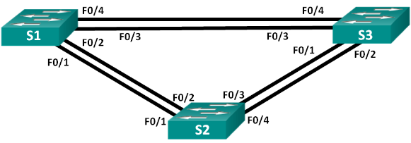
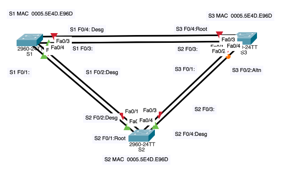

**Лабораторная работа. Развертывание коммутируемой сети с резервными каналами**

**Топология**



**Таблица адресации**

|**Устройство**|**Интерфейс**|**IP-адрес**|**Маска подсети**|
| :-: | :-: | :-: | :-: |
|S1|VLAN 1|192\.168.1.1|255\.255.255.0|
|S2|VLAN 1|192\.168.1.2|255\.255.255.0|
|S3|VLAN 1|192\.168.1.3|255\.255.255.0|

**Цели**

**Часть 1. Создание сети и настройка основных параметров устройства**
 
**Часть 2. Выбор корневого моста**
 
**Часть 3. Наблюдение за процессом выбора протоколом STP порта, исходя из стоимости портов**
 
**Часть 4. Наблюдение за процессом выбора протоколом STP порта, исходя из приоритета портов**

**Решение**

**Необходимые ресурсы**
- 3 коммутатора (Cisco 2960 с операционной системой Cisco IOS 15.0(2) (образ lanbasek9) или аналогичная модель)
- Консольные кабели для настройки устройств Cisco IOS через консольные порты
- Кабели Ethernet, расположенные в соответствии с топологией
1. **Создание сети и настройка основных параметров устройства**

В части 1 вам предстоит настроить топологию сети и основные параметры маршрутизаторов.

1. **Создайте сеть согласно топологии.**

Подключите устройства, как показано в топологии, и подсоедините необходимые кабели.

1. **Выполните инициализацию и перезагрузку коммутаторов.**
1. **Настройте базовые параметры каждого коммутатора.**
   1. Отключите поиск DNS.
   1. Присвойте имена устройствам в соответствии с топологией.
   1. Назначьте **class** в качестве зашифрованного пароля доступа к привилегированному режиму.
   1. Назначьте **cisco** в качестве паролей консоли и VTY и активируйте вход для консоли и VTY каналов.
   1. Настройте logging synchronous для консольного канала.
   1. Настройте баннерное сообщение дня (MOTD) для предупреждения пользователей о запрете несанкционированного доступа.
   1. Задайте IP-адрес, указанный в таблице адресации для VLAN 1 на всех коммутаторах.
   1. Скопируйте текущую конфигурацию в файл загрузочной конфигурации.

```Switch>en 
Switch#configure terminal 
Enter configuration commands, one per line. End with CNTL/Z.
Switch(config)#hostname S1 
S1(config)#no ip domain-lookup 
S1(config)#enable secret class 
S1(config)#line console 0 
S1(config-line)#password cisco 
S1(config-line)#logging synchronous 
S1(config-line)#exit 
S1(config)#line vty 0 15 
S1(config-line)#password cisco 
S1(config-line)#login
S1(config-line)#banner motd @Autorized Access Only@ 
S1(config)#int vlan1 
S1(config-if)#ip address 192.168.1.1 255.255.255.0 
S1(config-if)#no shutdown 
S1(config-if)#
%LINK-5-CHANGED: Interface Vlan1, changed state to up
%LINEPROTO-5-UPDOWN: Line protocol on Interface Vlan1, changed state to up
S1(config-if)#end
S1#
%SYS-5-CONFIG\_I: Configured from console by console
S1#copy running-config startup-config 
Destination filename [startup-config]? 
Building configuration...
[OK]

Switch>
Switch>en
Switch#conf t
Enter configuration commands, one per line. End with CNTL/Z.
Switch(config)#hostname S2
S2(config)#no ip domain-lookup
S2(config)#enable secret class 
S2(config)#line console 0
S2(config-line)#password cisco 
S2(config-line)#logging synchronous 
S2(config-line)#exit 
S2(config)#line vty 0 15 
S2(config-line)#password cisco
S2(config-line)#login
S2(config-line)#exit
S2(config)#banner motd @Autorizaition Acceess Only@
S2(config)#int vlan1
S2(config-if)#ip address 192.168.1.2 255.255.255.0 
S2(config-if)#no shutdown 
S2(config-if)#
%LINK-5-CHANGED: Interface Vlan1, changed state to up
%LINEPROTO-5-UPDOWN: Line protocol on Interface Vlan1, changed state to up
S2(config-if)#
S2(config-if)#exit
S2(config-if)#^Z
S2#
%SYS-5-CONFIG\_I: Configured from console by console
S2#copy running-config startup-config 
Destination filename [startup-config]? 
Building configuration...
[OK]

Switch>
Switch>en
Switch#conf t
Enter configuration commands, one per line. End with CNTL/Z.
Switch(config)#hostname S3 
S3(config)#no ip domain-lookup 
S3(config)#enable secret class
S3(config)#line console 0 
S3(config-line)#password cisco 
S3(config-line)#logging synchronous 
S3(config-line)#exit
S3(config)#line vty 0 15 
S3(config-line)#password cisco 
S3(config-line)#login
S3(config-line)#exit
S3(config)#banner motd @Autorization Acceess Only@ 
S3(config)#int vlan1
S3(config-if)#ip address 192.168.1.3 255.255.255.0 
S3(config-if)#no shutdown
S3(config-if)#
%LINK-5-CHANGED: Interface Vlan1, changed state to up
%LINEPROTO-5-UPDOWN: Line protocol on Interface Vlan1, changed state to up
S3(config-if)#
S3#
%SYS-5-CONFIG\_I: Configured from console by console
S3#copy running-config startup-config 
Destination filename [startup-config]? 
Building configuration...
[OK]
```

1. **Проверьте связь.**

Успешно ли выполняется эхо-запрос от коммутатора S1 на коммутатор S2?	**Да**
```
S1#ping 192.168.1.2

Type escape sequence to abort.
Sending 5, 100-byte ICMP Echos to 192.168.1.2, timeout is 2 seconds:
..!!!
Success rate is 60 percent (3/5), round-trip min/avg/max = 0/0/0 ms
```
Успешно ли выполняется эхо-запрос от коммутатора S1 на коммутатор S3?	**Да**
```
S1#ping 192.168.1.3
Type escape sequence to abort.
Sending 5, 100-byte ICMP Echos to 192.168.1.3, timeout is 2 seconds:
..!!!
Success rate is 60 percent (3/5), round-trip min/avg/max = 0/0/0 ms
```
Успешно ли выполняется эхо-запрос от коммутатора S2 на коммутатор S3?	**Да**
```
S2#ping 192.168.1.3
Type escape sequence to abort.
Sending 5, 100-byte ICMP Echos to 192.168.1.3, timeout is 2 seconds:
..!!!
Success rate is 60 percent (3/5), round-trip min/avg/max = 0/0/0 ms
```
1. **Определение корневого моста**

Для каждого экземпляра протокола spanning-tree (коммутируемая сеть LAN или широковещательный домен) существует коммутатор, выделенный в качестве корневого моста. Корневой мост служит точкой привязки для всех расчётов протокола spanning-tree, позволяя определить избыточные пути, которые следует заблокировать.

Процесс выбора определяет, какой из коммутаторов станет корневым мостом. Коммутатор с наименьшим значением идентификатора моста (BID) становится корневым мостом. Идентификатор BID состоит из значения приоритета моста, расширенного идентификатора системы и MAC-адреса коммутатора. Значение приоритета может находиться в диапазоне от 0 до 65535 с шагом 4096. По умолчанию используется значение 32768.

1. **Отключите все порты на коммутаторах.**
```
S3#en
S3#conf t
Enter configuration commands, one per line.  End with CNTL/Z.
S3(config)#interface range fa0/1-24,g0/1-2
S3(config-if-range)#sh
S3(config-if-range)#shutdown
```
1. **Настройте подключенные порты в качестве транковых.**
```
S3(config)#int range f0/1-4  
S3(config-if-range)#switchport mode trunk  
S3(config-if-range)#end  

S1(config)#int range f0/1-4  
S1(config-if-range)#switchport mode trunk  
S1(config-if-range)#end  

S2(config)#int range f0/1-4  
S2(config-if-range)#switchport mode trunk  
S2(config-if-range)#end  
S2#  
```
1. **Включите порты F0/2 и F0/4 на всех коммутаторах.**

На примере S2
```
S2#conf t
Enter configuration commands, one per line.  End with CNTL/Z.
S2(config)#int range f0/2,f0/4 
S2(config-if-range)#no sh
%LINK-5-CHANGED: Interface FastEthernet0/4, changed state to down
S2(config-if-range)#
%LINK-5-CHANGED: Interface FastEthernet0/2, changed state to up
%LINEPROTO-5-UPDOWN: Line protocol on Interface FastEthernet0/2, changed state to up
%LINEPROTO-5-UPDOWN: Line protocol on Interface Vlan1, changed state to up
S2(config-if-range)#
%LINK-5-CHANGED: Interface FastEthernet0/4, changed state to up
%LINEPROTO-5-UPDOWN: Line protocol on Interface FastEthernet0/4, changed state to up
```
1. **Отобразите данные протокола spanning-tree.**
```
S1#show spanning-tree 
VLAN0001
`  `Spanning tree enabled protocol ieee
`  `Root ID    Priority    32769
`             `Address     0005.5E4D.E96D
`             `This bridge is the root
`             `Hello Time  2 sec  Max Age 20 sec  Forward Delay 15 sec
`  `Bridge ID  Priority    32769  (priority 32768 sys-id-ext 1)
`             `Address     0005.5E4D.E96D
`             `Hello Time  2 sec  Max Age 20 sec  Forward Delay 15 sec
`             `Aging Time  20
Interface        Role Sts Cost      Prio.Nbr Type
\---------------- ---- --- --------- -------- --------------------------------
Fa0/4            Desg FWD 19        128.4    P2p
Fa0/2            Desg FWD 19        128.2    P2p
```
```
S2#show spanning-tree 
VLAN0001
`  `Spanning tree enabled protocol ieee
`  `Root ID    Priority    32769
`             `Address     0005.5E4D.E96D
`             `Cost        19
`             `Port        2(FastEthernet0/2)
`             `Hello Time  2 sec  Max Age 20 sec  Forward Delay 15 sec
`  `Bridge ID  Priority    32769  (priority 32768 sys-id-ext 1)
`             `Address     0050.0F5E.1527
`             `Hello Time  2 sec  Max Age 20 sec  Forward Delay 15 sec
`             `Aging Time  20
Interface        Role Sts Cost      Prio.Nbr Type
\---------------- ---- --- --------- -------- --------------------------------
Fa0/4            Desg FWD 19        128.4    P2p
Fa0/2            Root FWD 19        128.2    P2p
```
```
S3#show spanning-tree 
VLAN0001
`  `Spanning tree enabled protocol ieee
`  `Root ID    Priority    32769
`             `Address     0005.5E4D.E96D
`             `Cost        19
`             `Port        4(FastEthernet0/4)
`             `Hello Time  2 sec  Max Age 20 sec  Forward Delay 15 sec
`  `Bridge ID  Priority    32769  (priority 32768 sys-id-ext 1)
`             `Address     00E0.A39D.12BB
`             `Hello Time  2 sec  Max Age 20 sec  Forward Delay 15 sec
`             `Aging Time  20
Interface        Role Sts Cost      Prio.Nbr Type
\---------------- ---- --- --------- -------- --------------------------------
Fa0/2            Altn BLK 19        128.2    P2p
Fa0/4            Root FWD 19        128.4    P2p
```
**Примечание**. Режим STP по умолчанию на коммутаторе 2960 — протокол STP для каждой сети VLAN (PVST).

В схему ниже запишите роль и состояние (Sts) активных портов на каждом коммутаторе в топологии.



С учетом выходных данных, поступающих с коммутаторов, ответьте на следующие вопросы.

Какой коммутатор является корневым мостом? **S1**

Почему этот коммутатор был выбран протоколом spanning-tree в качестве корневого моста?

**Коммутатор S1 был выбран корневым мостом, т.к. имеет самый низкий MAC- адрес при равенстве остальных параметров на всех** 

**коммутаторах** 

Какие порты на коммутаторе являются корневыми портами? **S2 F0/2:Root и S3 F0/4:Root**

Какие порты на коммутаторе являются назначенными портами? **Порты корневого коммутатора S1 и порт Fa0/4 S2**

Какой порт отображается в качестве альтернативного и в настоящее время заблокирован? **S3 F0/2:Altn**

Почему протокол spanning-tree выбрал этот порт в качестве невыделенного (заблокированного) порта?

**Сначала сравнивается стоимость пути до корневого моста. Для этой пары портов стоимость одинакова. По этой причине сравниваются BID коммутаторов.**

1. **Определите коммутатор с заблокированным портом.**
```
S3#show spanning-tree 
VLAN0001
`  `Spanning tree enabled protocol ieee
`  `Root ID    Priority    32769
`             `Address     0005.5E4D.E96D
`             `Cost        19
`             `Port        4(FastEthernet0/4)
`             `Hello Time  2 sec  Max Age 20 sec  Forward Delay 15 sec
`  `Bridge ID  Priority    32769  (priority 32768 sys-id-ext 1)
`             `Address     00E0.A39D.12BB
`             `Hello Time  2 sec  Max Age 20 sec  Forward Delay 15 sec
`             `Aging Time  20
Interface        Role Sts Cost      Prio.Nbr Type
\---------------- ---- --- --------- -------- --------------------------------
Fa0/2            Altn BLK 19        128.2    P2p
Fa0/4            Root FWD 19        128.4    P2p
```
1. **Измените стоимость порта.**

**S3(config)#int Fa0/4**            

**S3(config-if)#spanning-tree vlan 1 cost 18**

**S3(config-if)#**

1. **Просмотрите изменения протокола spanning-tree.**

Повторно выполните команду **show spanning-tree** на обоих коммутаторах некорневого моста. 
```
S3#show spanning-tree 
VLAN0001
`  `Spanning tree enabled protocol ieee
`  `Root ID    Priority    32769
`             `Address     0005.5E4D.E96D
`             `Cost        18
`             `Port        4(FastEthernet0/4)
`             `Hello Time  2 sec  Max Age 20 sec  Forward Delay 15 sec
`  `Bridge ID  Priority    32769  (priority 32768 sys-id-ext 1)
`             `Address     00E0.A39D.12BB
`             `Hello Time  2 sec  Max Age 20 sec  Forward Delay 15 sec
`             `Aging Time  20
Interface        Role Sts Cost      Prio.Nbr Type
\---------------- ---- --- --------- -------- --------------------------------
Fa0/2            Desg FWD 19        128.2    P2p
Fa0/4            Root FWD 18        128.4    P2p
```
```
S2#sh spanning-tree 
VLAN0001
`  `Spanning tree enabled protocol ieee
`  `Root ID    Priority    32769
`             `Address     0005.5E4D.E96D
`             `Cost        19
`             `Port        2(FastEthernet0/2)
`             `Hello Time  2 sec  Max Age 20 sec  Forward Delay 15 sec
`  `Bridge ID  Priority    32769  (priority 32768 sys-id-ext 1)
`             `Address     0050.0F5E.1527
`             `Hello Time  2 sec  Max Age 20 sec  Forward Delay 15 sec
`             `Aging Time  20
Interface        Role Sts Cost      Prio.Nbr Type
\---------------- ---- --- --------- -------- --------------------------------
Fa0/4            Altn BLK 19        128.4    P2p
Fa0/2            Root FWD 19        128.2    P2p
```
Почему протокол spanning-tree заменяет ранее заблокированный порт на назначенный порт и блокирует порт, который был назначенным портом на другом коммутаторе?

**Протокол STP заменяет и блокирует ранее назначенный порт, т.к. появляется порт с меньшей стоимотью пути к корневому мосту.** 

1. **Удалите изменения стоимости порта.**
   1. Выполните команду **no spanning-tree vlan 1 cost 18** режима конфигурации интерфейса, чтобы удалить запись стоимости, созданную ранее.
```
      S3(config)#int Fa0/4            
      S3(config-if)#no spanning-tree vlan 1 cost 18
```
   1. Повторно выполните команду **show spanning-tree**, чтобы подтвердить, что протокол STP сбросил порт на коммутаторе некорневого моста, вернув исходные настройки порта. Протоколу STP требуется примерно 30 секунд, чтобы завершить процесс перевода порта.

```
S3#show spanning-tree 
VLAN0001
` `Spanning tree enabled protocol ieee
` `Root ID Priority 32769
`         `Address 0005.5E4D.E96D
`         `Cost 19
`         `Port 4(FastEthernet0/4)
`         `Hello Time 2 sec Max Age 20 sec Forward Delay 15 sec
` `Bridge ID Priority 32769 (priority 32768 sys-id-ext 1)
`          `Address 00E0.A39D.12BB
`          `Hello Time 2 sec Max Age 20 sec Forward Delay 15 sec
`          `Aging Time 20
Interface         Role Sts Cost      Prio.Nbr Type
\---------------- ---- --- --------- -------- --------------------------------
Fa0/2             Desg FWD 19 128.2 P2p
Fa0/4             Root FWD 19 128.4 P2p
```

1. **Наблюдение за процессом выбора протоколом STP порта, исходя из приоритета портов**
   1. Включите порты F0/1 и F0/3 на всех коммутаторах.
```
S1(config)#int range fa0/1,fa0/3  
S1(config-if-range)#no shut
```
1. Подождите 30 секунд, чтобы протокол STP завершил процесс перевода порта, после чего выполните команду **show spanning-tree** на коммутаторах некорневого моста. Обратите внимание, что порт корневого моста переместился на порт с меньшим номером, связанный с коммутатором корневого моста, и заблокировал предыдущий порт корневого моста.
```
S1#show spanning-tree
VLAN0001
` `Spanning tree enabled protocol ieee
   Root ID  Priority 32769
            Address 0005.5E4D.E96D
            This bridge is the root
            Hello Time 2 sec Max Age 20 sec Forward Delay 15 sec
` `Bridge ID Priority 32769 (priority 32768 sys-id-ext 1)
            Address 0005.5E4D.E96D
            Hello Time 2 sec Max Age 20 sec Forward Delay 15 sec
            Aging Time 20
Interface         Role Sts Cost       Prio.Nbr Type
\---------------- ---- --- --------- -------- --------------------------------
Fa0/4             Desg FWD 19          128.4 P2p
Fa0/3             Desg FWD 19          128.3 P2p
Fa0/2             Desg FWD 19          128.2 P2p
Fa0/1             Desg FWD 19          128.1 P2p
```
```
S1#show spanning-tree
VLAN0001
` `Spanning tree enabled protocol ieee
Root ID  Priority 32769
         Address 0005.5E4D.E96D
         This bridge is the root
         Hello Time 2 sec Max Age 20 sec Forward Delay 15 sec
` `Bridge ID Priority 32769 (priority 32768 sys-id-ext 1)
         Address 0005.5E4D.E96D
         Hello Time 2 sec Max Age 20 sec Forward Delay 15 sec
         Aging Time 20
Interface         Role Sts Cost      Prio.Nbr Type
\---------------- ---- --- --------- -------- --------------------------------
Fa0/4             Desg FWD 19          128.4 P2p
Fa0/3             Desg FWD 19          128.3 P2p
Fa0/2             Desg FWD 19          128.2 P2p
Fa0/1             Desg FWD 19          128.1 P2p
```
```
S3#show spanning-tree
VLAN0001
Spanning tree enabled protocol ieee
` `Root ID  Priority 32769
            Address 0005.5E4D.E96D
            Cost 19
            Port 3(FastEthernet0/3)
            Hello Time 2 sec Max Age 20 sec Forward Delay 15 sec
Bridge ID   Priority 32769 (priority 32768 sys-id-ext 1)
            Address 00E0.A39D.12BB
            Hello Time 2 sec Max Age 20 sec Forward Delay 15 sec
            Aging Time 20
Interface          Role Sts Cost     Prio.Nbr Type
\---------------- ---- --- --------- -------- --------------------------------
Fa0/1             Altn BLK 19            128.1 P2p
Fa0/2             Altn BLK 19            128.2 P2p
Fa0/3             Root FWD 19            128.3 P2p
Fa0/4             Altn BLK 19            128.4 P2p
```
Какой порт выбран протоколом STP в качестве порта корневого моста на каждом коммутаторе некорневого моста? 

**На коммутаторе S2 корневым портом выбран порт Fa0/1, на коммутаторе S3 корневым портом выбран порт Fa0/3.**  

Почему протокол STP выбрал эти порты в качестве портов корневого моста на этих коммутаторах?

**В качестве порта корневого моста выбран один порт из двух, связаннных с корневым мостом, имеющий наименьший номер порт,  при равенстве приоритетов (по умолчанию 128)** 

**Вопросы для повторения**
1. Какое значение протокол STP использует первым после выбора корневого моста, чтобы определить выбор порта?

**Стоимость маршрута**.

1. Если первое значение на двух портах одинаково, какое следующее значение будет использовать протокол STP при выборе порта?

**Приоритеты портов.**

1. Если оба значения на двух портах равны, каким будет следующее значение, которое использует протокол STP при выборе порта?

**BID коммутаторов.**
